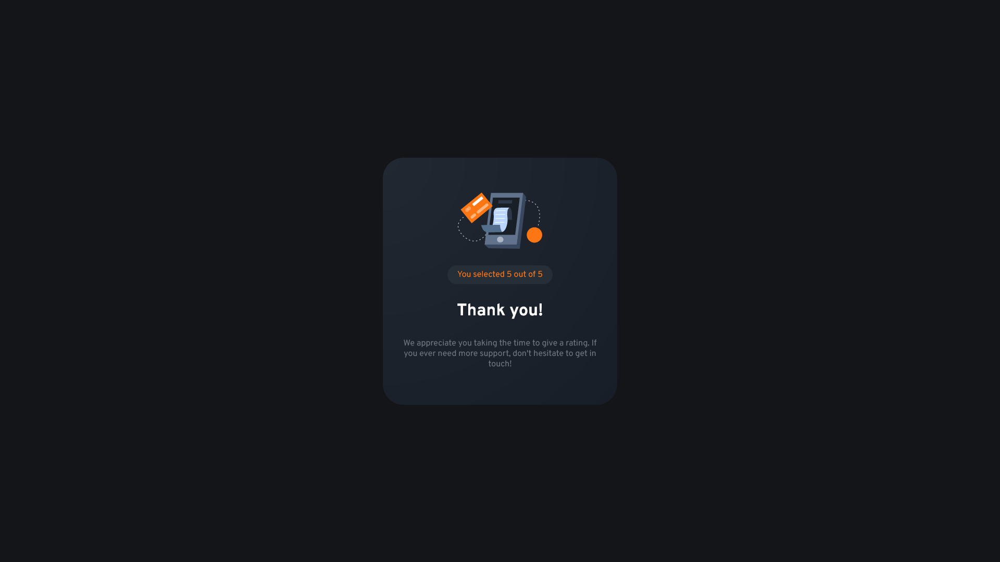

# Interactive Rating Card

## Table of contents

- [Overview](#overview)
  - [Links](#links)
- [My process](#my-process)
  - [Tools](#tools)
  - [What I learned](#what-i-learned)
- [Author](#author)
- [Acknowledgments](#acknowledgments)

## Overview

This project is a simple, interactive rating card component that allows users to give a rating on a scale of 1 to 5. Originally this is my solution to the Interactive rating component challenge on Frontend Mentor using simple JavaScript to update the DOM. However I took the opportunity to build out my solution using React and styled-components. It also served as an opportunity to practice using the useState hook.

### Links

- Live Site URL: [Interactive Rating Card](https://johnlombardi389.github.io/product-preview-card/)

## My process

### Tools

- React
- JavaScript
- Styled-Components / Sass
- useState hook
- Flexbox
- Visual Studio Code
- Git

### What I learned

- Better understanding of how to use React to build user interfaces
- Using props and state to pass data between components
- Knowledge of how to use styled-components and Sass to style React components
- Continued understanding of how to use the useState hook to manage component state
- Experience with debugging, troubleshooting and problem-solving in a development environment

## Author

John Lombardi

- [Portfolio](https://johnlombardi389.github.io/portfolio/)
- [LinkedIn](https://www.linkedin.com/in/johnlombardi389/)
- [GitHub](https://github.com/johnlombardi389)
- [Frontend Mentor](https://www.frontendmentor.io/profile/johnlombardi389)

## Acknowledgments

- [Interactive rating component challenge on Frontend Mentor](https://www.frontendmentor.io/challenges/interactive-rating-component-koxpeBUmI)
